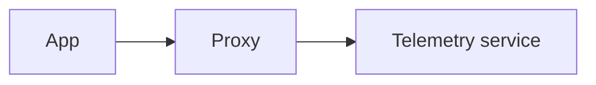

# GDPR Compliant Telemetry Proxy

If an application sends telemetry data to a monitoring provider, the IP address of the user is likely going to be stored within the access logs of the monitoring providers server. In the EU the users IP address is considered personal data. If an app provider does not want to share any of the users personal data, the provider would need to install a proxy which removes the IP address of the user before the request is send to a third party. This proxy must also not store the IP address of the user of course. 
 
The server in this repository is an implementation of such proxy. Telemetry data is send to this service and the plain data is forwarded to the third party monitoring system - in this case LogSnap. LogSnag itself does not provide an option to disable server access logs unfortunately hence the need of this proxy. Just like any other proxy, the setup then looks like this:

