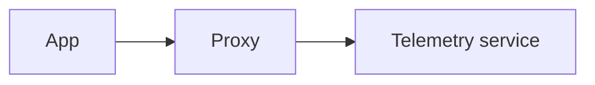

# GDPR Compliant Telemetry Proxy

If an application sends telemetry data to a monitoring provider, the IP address of the user is likely going to be stored within the access logs of the monitoring providers server. In the EU the users IP address is considered personal data. If an app provider does not want to share the users personal data, the provider would need to install a proxy, which removed the IP address of the user. This proxy must also not store the IP address of the user of course. 
 
This service in this repository, acts is an implementation of such proxy. Telemetry data is send to this service, no access logs are stored and the plain data is forwarded to a monitoring system, in this case LogSnap - a service hosted in the US. LogSnag itself does not provide an option to disable server access logs unfortunately, hence the need of this proxy. Just like any other proxy basically it looks like this then:

